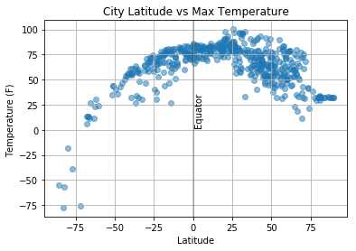

## Analysis:

-Humidity and cloudiness have little coorelation to latitude.  

-Wind Speed increases greatly in cities below the Equator with the most common speed occuring between 0 and 20 mph. 

-Tempature plot graph looks like a mustache as well as an inkblot of the shape of Hawaii


```python
import matplotlib.pyplot as plt
import pandas as pd
import numpy as np
import requests
import time
import csv
```


```python
from citipy import citipy
```


```python
output_data_file = 'output_data/cities.csv'
```


```python
lats = np.random.uniform(low=-90.000, high=90.000, size=1500)
lngs = np.random.uniform(low=-180.000, high=180.000, size=1500)
```


```python
from collections import defaultdict
```


```python
lat_lng = defaultdict()
```


```python
lat_lngs = zip(lats, lngs)
for x in lat_lngs:
    lat, long = x
    city = citipy.nearest_city(lat, long).city_name
    lat_lng[city] = [lat, long]
    
```


```python
df = pd.DataFrame(list(lat_lng.items()))
df.columns = ['city','lat_long']
df['lat'] = df.lat_long.map(lambda x: str(x[0]))
df['lon'] = df.lat_long.map(lambda x: str(x[1]))
print(df.shape)
df.head()
```

    (582, 4)


<div>
<style scoped>
    .dataframe tbody tr th:only-of-type {
        vertical-align: middle;
    }

    .dataframe tbody tr th {
        vertical-align: top;
    }

    .dataframe thead th {
        text-align: right;
    }
</style>
<table border="1" class="dataframe">
  <thead>
    <tr style="text-align: right;">
      <th></th>
      <th>city</th>
      <th>lat_long</th>
      <th>lat</th>
      <th>lon</th>
    </tr>
  </thead>
  <tbody>
    <tr>
      <th>0</th>
      <td>laksar</td>
      <td>[29.596757892029913, 77.94290561514327]</td>
      <td>29.596757892029913</td>
      <td>77.94290561514327</td>
    </tr>
    <tr>
      <th>1</th>
      <td>albany</td>
      <td>[-62.228986566153466, 123.14109884543211]</td>
      <td>-62.228986566153466</td>
      <td>123.14109884543211</td>
    </tr>
    <tr>
      <th>2</th>
      <td>cape town</td>
      <td>[-82.42862964865863, -14.633849958079452]</td>
      <td>-82.42862964865863</td>
      <td>-14.633849958079452</td>
    </tr>
    <tr>
      <th>3</th>
      <td>qaanaaq</td>
      <td>[78.45778989767143, -74.12275029612269]</td>
      <td>78.45778989767143</td>
      <td>-74.12275029612269</td>
    </tr>
    <tr>
      <th>4</th>
      <td>terney</td>
      <td>[45.99460781181196, 136.9953838066284]</td>
      <td>45.99460781181196</td>
      <td>136.9953838066284</td>
    </tr>
  </tbody>
</table>
</div>


```python
def get_current_weather(df_object):
    api_key = '43e9bcde4ac68b9a23022ffacb5ace0d'
    base_url = 'http://api.openweathermap.org/data/2.5/weather'
    params = {
        'APPID': api_key,
        'lat': df_object.lat,
        'lon': df_object.lon,
        'units': 'Imperial'
        
    }
    data = requests.get(base_url, params=params)
    return data.json()
    time.sleep(.50)
```


```python
sample = df.sample(n=500)
sample['weather_json'] = sample.apply(get_current_weather, axis=1)
sample['temp'] = sample.weather_json.map(lambda x: x.get('main').get('temp') )
sample['humidity'] = sample.weather_json.map(lambda x: x.get('main').get('humidity') )
sample['cloudiness'] = sample.weather_json.map(lambda x: x.get('clouds').get('all') )
sample['wind_speed'] = sample.weather_json.map(lambda x: x.get('wind').get('speed') )
sample['plot_lat'] = sample.weather_json.map(lambda x: x.get('coord').get('lat') )


sample.head()
```


<div>
<style scoped>
    .dataframe tbody tr th:only-of-type {
        vertical-align: middle;
    }

    .dataframe tbody tr th {
        vertical-align: top;
    }

    .dataframe thead th {
        text-align: right;
    }
</style>
<table border="1" class="dataframe">
  <thead>
    <tr style="text-align: right;">
      <th></th>
      <th>city</th>
      <th>lat_long</th>
      <th>lat</th>
      <th>lon</th>
      <th>weather_json</th>
      <th>temp</th>
      <th>humidity</th>
      <th>cloudiness</th>
      <th>wind_speed</th>
      <th>plot_lat</th>
    </tr>
  </thead>
  <tbody>
    <tr>
      <th>72</th>
      <td>lagoa</td>
      <td>[51.050445982743895, -29.0419764721955]</td>
      <td>51.050445982743895</td>
      <td>-29.0419764721955</td>
      <td>{'coord': {'lon': -29.04, 'lat': 51.05}, 'weat...</td>
      <td>54.11</td>
      <td>100</td>
      <td>68</td>
      <td>6.17</td>
      <td>51.05</td>
    </tr>
    <tr>
      <th>445</th>
      <td>beloha</td>
      <td>[-27.247516955695573, 42.499729212329896]</td>
      <td>-27.247516955695573</td>
      <td>42.499729212329896</td>
      <td>{'coord': {'lon': 42.5, 'lat': -27.25}, 'weath...</td>
      <td>72.29</td>
      <td>100</td>
      <td>0</td>
      <td>13.44</td>
      <td>-27.25</td>
    </tr>
    <tr>
      <th>174</th>
      <td>beisfjord</td>
      <td>[65.89515975313313, 18.15401718253625]</td>
      <td>65.89515975313313</td>
      <td>18.15401718253625</td>
      <td>{'coord': {'lon': 18.15, 'lat': 65.9}, 'weathe...</td>
      <td>55.40</td>
      <td>62</td>
      <td>56</td>
      <td>5.82</td>
      <td>65.90</td>
    </tr>
    <tr>
      <th>124</th>
      <td>barentsburg</td>
      <td>[88.2039835268175, 7.227084580544471]</td>
      <td>88.2039835268175</td>
      <td>7.227084580544471</td>
      <td>{'coord': {'lon': 7.23, 'lat': 88.2}, 'weather...</td>
      <td>32.24</td>
      <td>98</td>
      <td>80</td>
      <td>17.81</td>
      <td>88.20</td>
    </tr>
    <tr>
      <th>399</th>
      <td>hihifo</td>
      <td>[-16.835876035519604, -175.37052933259383]</td>
      <td>-16.835876035519604</td>
      <td>-175.37052933259383</td>
      <td>{'coord': {'lon': -175.37, 'lat': -16.84}, 'we...</td>
      <td>78.23</td>
      <td>100</td>
      <td>64</td>
      <td>2.15</td>
      <td>-16.84</td>
    </tr>
  </tbody>
</table>
</div>


## Temperature (F) vs. Latitude


```python
plt.scatter(sample["plot_lat"], sample["temp"], alpha=0.5)

plt.title("City Latitude vs Max Temperature")
plt.axvline(0, color = 'black', alpha = .25, label = 'Equator') #adds equator line
plt.text(1,30,'Equator',rotation=90)
plt.ylabel("Temperature (F) ")
plt.xlabel("Latitude")
plt.grid(True)

plt.show()
```





## Humidity (%) vs. Latitude


```python
plt.scatter(sample["plot_lat"], sample["humidity"], alpha=0.5)

plt.title(" Latitude vs humidity")
plt.axvline(0, color = 'black', alpha = .25, label = 'Equator') #adds equator line
plt.text(1,30,'Equator',rotation=90)
plt.ylabel("Humidity(%) ")
plt.xlabel("Latitude")
plt.grid(True)

plt.show()
```


## Cloudiness (%) vs. Latitude


```python
plt.scatter(sample["plot_lat"], sample["cloudiness"], alpha=0.5)

plt.title(" Latitude vs cloudiness")
plt.axvline(0, color = 'black', alpha = .25, label = 'Equator') #adds equator line
plt.text(1,30,'Equator',rotation=90)
plt.ylabel("Cloudiness")
plt.xlabel("Latitude")
plt.grid(True)

plt.show()
```


## Wind Speed (mph) vs. Latitude


```python
plt.scatter(sample["plot_lat"], sample["wind_speed"], alpha=0.5)

plt.title(" Latitude vs wind_speed")
plt.axvline(0, color = 'black', alpha = .25, label = 'Equator') #adds equator line
plt.text(1,30,'Equator',rotation=90)
plt.ylabel("Wind Speed ")
plt.xlabel("Latitude")
plt.grid(True)

plt.show()
```


